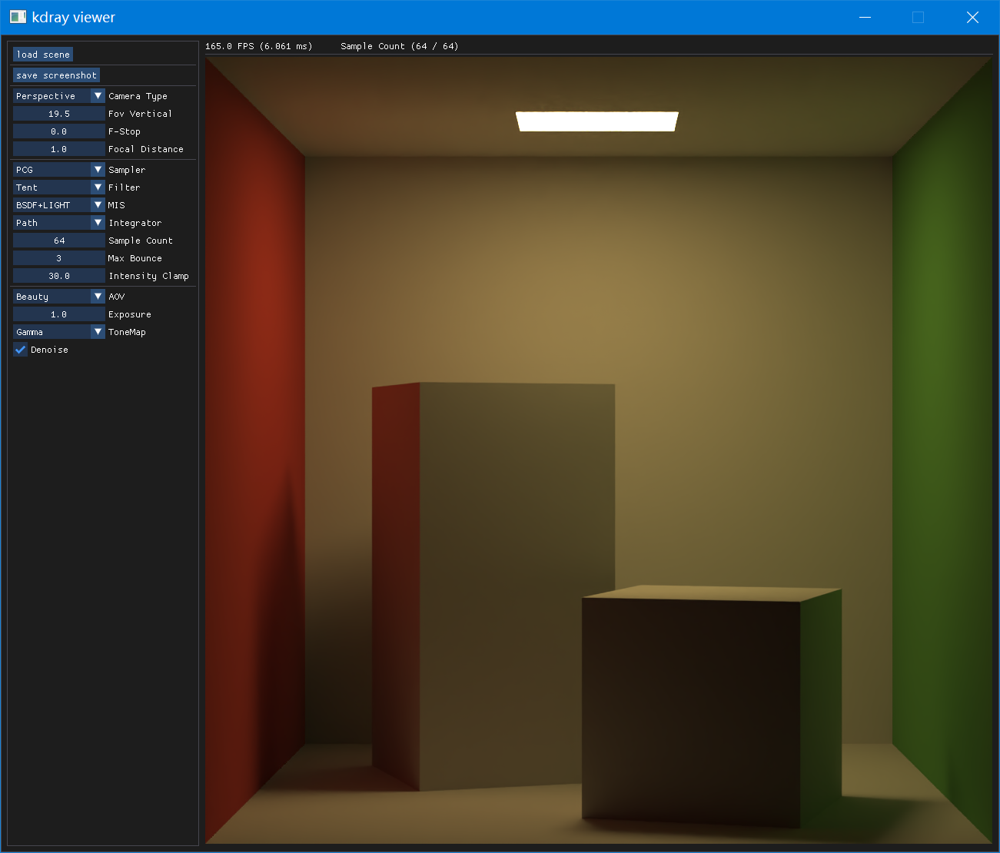
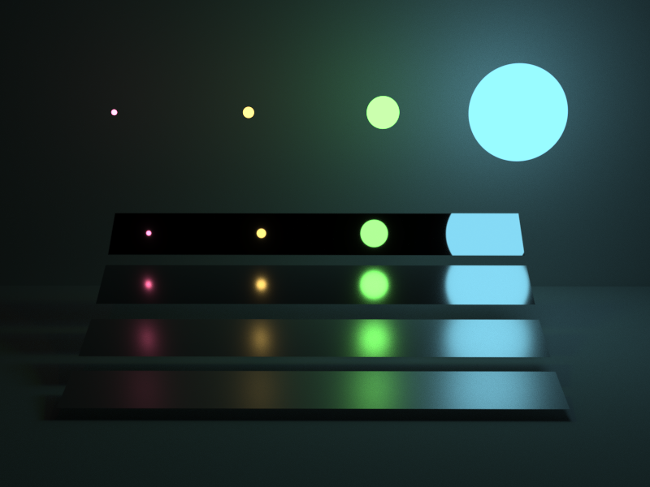
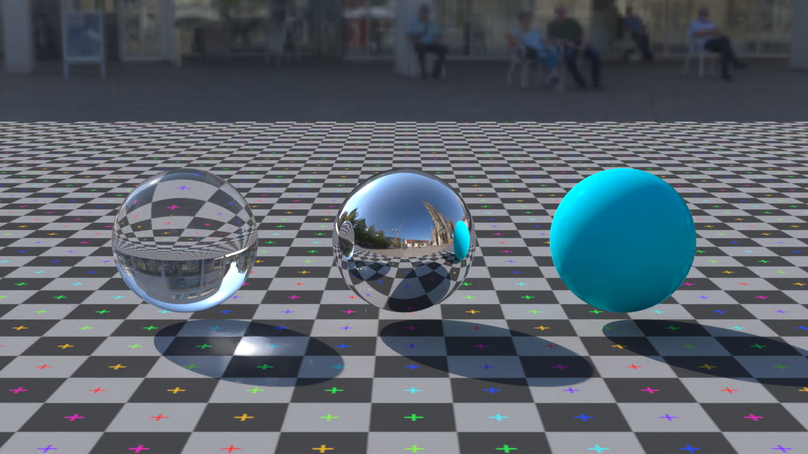
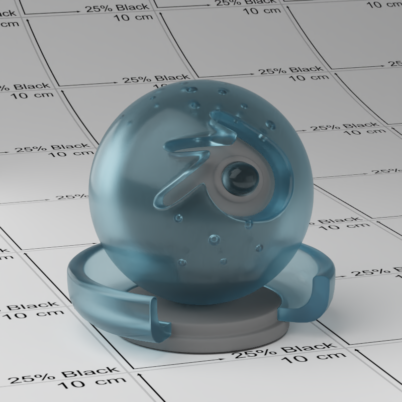
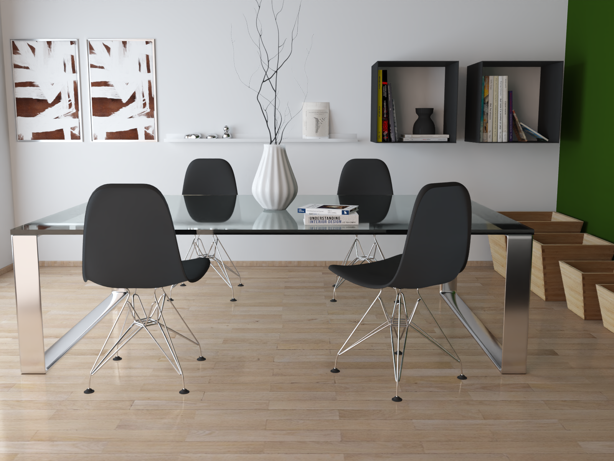
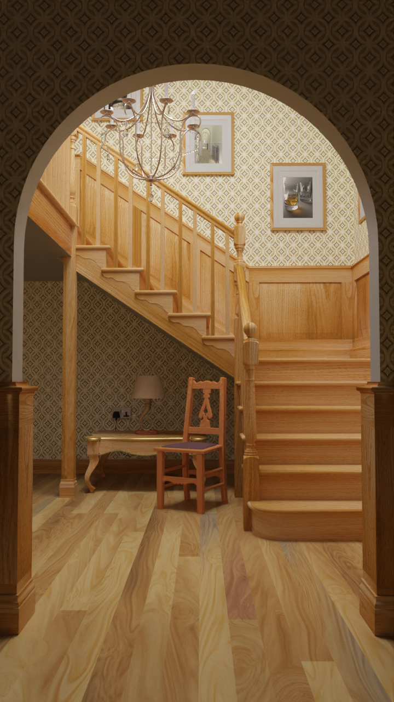
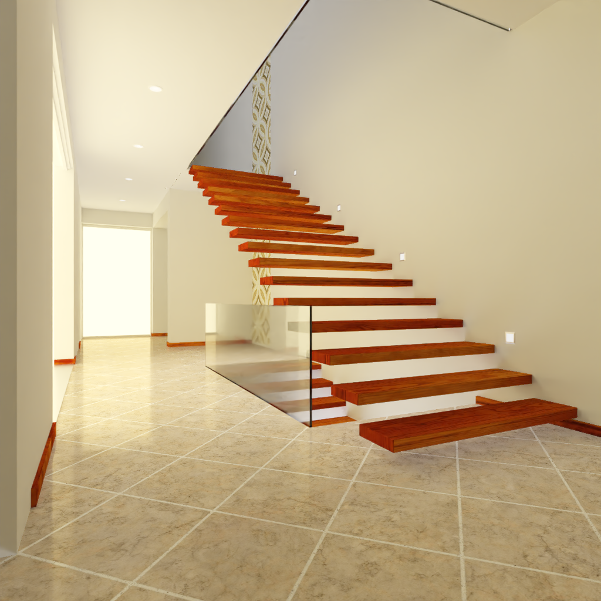

## 特性 Features

* 路径追踪全局光照 Path tracing Global-illumination

* 多重重要性采样 Multiple importance sampling

* hdri重要性采样 Hdri importance sampling

* 微表面分布 Microfacet distribution

* 迪士尼原型材质 disney principled material

* 薄镜模型景深 depth of field

* 【材质】金属、玻璃、塑料、迪士尼 [material] metal glass plastic disney

* 【灯光】定向光、环境、矩形、球、圆盘、聚光灯 [light] directional dome rect point disk spot

## 截图 screenshot

## build
Cmake + Visual Studio + Optix7.6.0

## todo
* volume absorption + volume scatter
* mipmap + ray cone
* sobol sampler
* temporal denoise